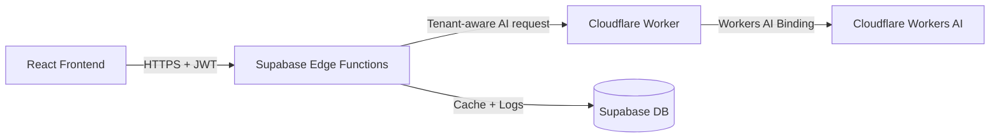

# 🤖 Prolific HR — AI Integration Guide

### **Cloudflare Workers AI × Supabase Edge Functions × React**

This document describes the **final, stable, production-grade AI architecture** used in Prolific HR.

It reflects the **real system** that is now working end-to-end.

---

# 🧩 1. System Overview

Prolific HR uses a **three-layer AI pipeline**:

### **Frontend → Supabase Edge Functions → Cloudflare Worker → Workers AI**

This ensures:

* **No API keys on the frontend**
* **Tenant-isolated caching & logging**
* **Model routing per task**
* **Consistent JSON output**
* **Full stack TypeScript safety**

---

# 🏗 2. Architecture Diagram



### Layer Explanation

#### **1. React Frontend**

* Uses `aiClient.ts` to call Edge Functions (never calls Worker directly)
* Hooks provide easy access to each AI feature

#### **2. Supabase Edge Functions**

Your secure backend layer for AI:

* Auth validation via Supabase JWT
* Tenant-aware rate limiting
* Tenant-aware caching (`ai_cache`)
* Request logging (`ai_logs`)
* Calls Cloudflare Worker securely
* Applies model routing logic

#### **3. Cloudflare Worker (Inference Orchestrator)**

NOT an AI Gateway.
It is your **gateway to Workers AI**, and it:

* Validates request structure
* Normalizes chat messages into content blocks
* Selects the model from the request
* Calls Cloudflare Workers AI via `env.AI.run()`
* Returns raw model output

#### **4. Cloudflare Workers AI**

The actual model execution happens here.

---

# 🤖 3. Model Routing (Final, Production Version)

Your system uses different models for different tasks, for speed, cost, and accuracy.

| Task Type                                            | Model                                       |
| ---------------------------------------------------- | ------------------------------------------- |
| **Chat / Summaries / Offer Letters / General UI AI** | `@cf/meta/llama-4-scout-17b-16e-instruct`   |
| **Reasoning / Ranking / Logic**                      | `@cf/deepseek/deepseek-r1-distill-qwen-32b` |
| **Embeddings / Semantic Search**                     | `@cf/baai/bge-large-en-v1.5`                |

This routing lives in your Supabase Edge Functions.

---

# 📦 4. Frontend Integration

### ⭕ Components (`src/components/ai/*`)

Each AI feature has its own UI component:

* `ApplicantSummaryPanel`
* `ApplicantRankingPanel`
* `OfferLetterDraftPanel`
* `OnboardingSummaryPanel`
* `SetupHelperPanel`

These components call hooks → hooks call Edge Functions → Edge Functions call Worker.

---

### ⭕ Hooks (`src/hooks/useAI.ts`)

Each hook wraps an AI feature:

```ts
const { generate, data, loading, error } = useAISummary();
const { generate, data, loading, error } = useAIRanking();
const { generate, data, loading, error } = useAIOfferLetter();
const { generate, data, loading, error } = useAIOnboarding();
const { generate, data, loading, error } = useAISetupHelper();
```

---

### ⭕ AI Client (`src/lib/aiClient.ts`)

The AI client:

* Builds task payloads
* Sends them to Supabase Edge Functions
* Parses and validates JSON
* Applies tenant identity
* Handles errors safely

---

### ⭕ Prompts & Schemas

#### **Prompts**

Stored in:
`src/lib/ai/prompts.ts`

Each feature gets a system prompt.

#### **Zod Schemas**

Stored in:
`src/lib/ai/schemas.ts`

Used to validate model output:

* `ApplicantSummarySchema`
* `ApplicantRankingSchema`
* `OfferLetterSchema`
* `OnboardingSummarySchema`
* `SetupHelperSchema`

---

# 🔐 5. Security

### ✔ No direct Worker access

Frontend never touches Cloudflare Worker directly.

### ✔ Access controlled by Supabase JWT

Edge Functions require:

* Valid session
* Valid tenant
* Role-based access (admin/staff)

### ✔ AI keys never exposed

`AI_GATEWAY_API_KEY` stays in Supabase secrets.

---

# ⚡ 6. Performance Optimizations

### **Tenant-Based Caching (`ai_cache`)**

Prevents duplicate calls.

### **Rate Limiting (`ai_logs`)**

60 requests/min per tenant.

### **Reduced Tokens**

Llama-4-Scout is cost-efficient and accurate.

### **Supabase Postgres Indexes**

On all timestamp + tenant_id columns.

---

# 📊 7. AI Monitoring Dashboard

Available at:

```
/admin/ai-dashboard
```

Displays:

* Per-tenant usage
* Token consumption
* Cache hit/miss
* Error logs
* Model usage heatmap

---

# 📝 8. Adding a New AI Feature

Steps:

### **1. Add your Zod schema**

`src/lib/ai/schemas.ts`

### **2. Add your system prompt**

`src/lib/ai/prompts.ts`

### **3. Add a handler in aiClient**

`src/lib/aiClient.ts`

### **4. Add a hook**

`src/hooks/useAI.ts`

### **5. Add a component**

`src/components/ai/YourNewPanel.tsx`

### **Optional:** Add tenant caching.

---

# 🧪 9. Testing the AI Pipeline

### **Test via curl**

```bash
curl -X POST https://hr-ai-worker.gridhouse-digital10.workers.dev \
  -H "Content-Type: application/json" \
  -H "x-api-key: YOUR_KEY" \
  -d '{
    "task": "chat",
    "input": {
      "messages": [
        { "role": "user", "content": "Hello" }
      ]
    }
  }'
```

### Expected:

```json
{
  "success": true,
  "result": {
    "response": "Hello! I'm here to help..."
  }
}
```

---

# 🧱 10. Summary

The Prolific HR AI architecture is:

### ✔ Stable

### ✔ Scalable

### ✔ Secure

### ✔ Multi-tenant

### ✔ Ready for production

### ✔ Easy to extend

All AI intelligence flows through:

**Frontend → Supabase Functions → Cloudflare Worker → Workers AI**

Ensuring reliability, clarity, and long-term maintainability.

---

