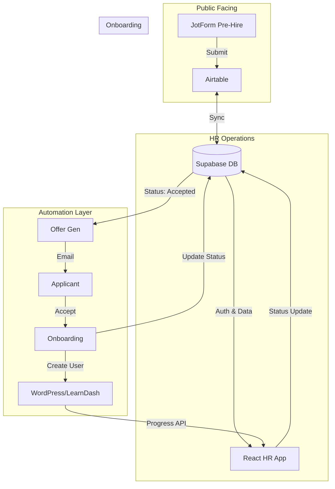

# Brainstorming Session Results

**Session Date:** 2025-11-27
**Facilitator:** Business Analyst Mary
**Participant:** BMad

## Session Start

Selected Option 4: Progressive Technique Flow.
We will systematically tackle:
1. **Architecture & Integrations** (System Design)
2. **Data Modeling** (Supabase & Airtable Schema)
3. **Process Flows** (Event Modeling)
4. **UI/UX Breakdown** (Component Mapping)

## Executive Summary

**Topic:** HR App Development (React + Supabase + Airtable)

**Session Goals:** 
- Design a single HR control panel to track employment status lifecycle.
- Automate offer letter generation and onboarding flows.
- Integrate seamlessly with existing WordPress/LearnDash and JotForm systems.
- Define technical architecture, database schema, and UI components.

**Techniques Used:** Progressive Flow (Mind Mapping, Structured Analysis, Event Modeling, Component Mapping)

**Total Ideas Generated:** 15+

### Key Themes Identified:

- **Hub & Spoke Architecture**
- **Event-Driven Automation**
- **Separation of Intake vs. Lifecycle**
- **Live Data Fetching**

## Technique Sessions

### 1. Architecture & Integrations (Mind Mapping)

**Goal:** Define system flow and source of truth.

**Outcome:**
- **Architecture:** Hub & Spoke model.
    - **Hub:** HR App (Supabase) - Master for HR logic & lifecycle.
    - **Intake:** Airtable - Primary for raw JotForm submissions.
    - **Execution:** WordPress/LearnDash - Training platform.
    - **Automation:** Zapier/n8n - Glue between systems.
- **Data Strategy:**
    - **Intake:** JotForm → Airtable (Primary Source).
    - **Lifecycle:** Supabase (Master Record) takes over once applicant enters HR workflow.
    - **Sync:**
        - Inbound (Airtable → Supabase): Applicant details.
        - Outbound (Supabase → Airtable): Status updates only.

**Diagram:**

### 2. Data Modeling (Structured Analysis)

**Goal:** Define database schema and separation of concerns.

**Decisions:**
- **Separation:** `employees` will be a separate table from `applicants` to keep data clean.
- **Onboarding Data:** Will be fetched **LIVE** from WordPress/LearnDash API (no local caching of granular lesson progress).

**Supabase Schema:**
- **`hr_users`**: Admin/Staff access.
- **`applicants`**: Synced from Airtable (Intake).
- **`employees`**: Linked to `applicants`, stores WP `user_id`, `start_date`, `status`.
- **`offers`**: Stores offer details, tokens, and status.
- **`status_history`**: Audit trail for all lifecycle changes.

**Airtable Schema:**
- **`Applicants` View**: Mirror of Supabase `applicants`.
- **`Employees` View**: Mirror of Supabase `employees` (status only).

### 3. Process Flows (Event Modeling)

**Goal:** Define automation triggers and actions.

**Decisions:**
- **Offer Generation:** Triggered by n8n webhook when status = `Accepted`.
- **Offer Review:** HR MUST review the generated offer content before sending.
- **Signature:** Applicant signs digitally (e.g., via signature pad or integration).
- **WP User Creation:** **ASYNC** via n8n/Zapier (Robustness > Speed).

**Defined Flows:**
1.  **Hired Event:**
    -   Trigger: Status → `Accepted`.
    -   Action: n8n Webhook → Generate PDF → Create `offer` (Pending Approval) → Notify HR.
2.  **Offer Sent Event:**
    -   Trigger: HR reviews & clicks "Approve & Send".
    -   Action: Update `offer` (Sent) → Email Applicant with Link.
3.  **Offer Accepted Event:**
    -   Trigger: Applicant signs & clicks "Accept".
    -   Action: Update `offer` (Accepted) → Create `employee` record → **Trigger n8n Webhook (Async)**.
    -   Async Job: Create WP User → Assign LearnDash Group → Update `employee` with `wp_user_id` → Set Status `Onboarding Started`.
4.  **Onboarding Loop:**
    -   Trigger: HR views Dashboard.
    -   Action: React App calls WP API (Live Fetch) → Updates Progress Bar.

### 4. UI/UX Breakdown (Component Mapping)

**Goal:** Define application structure and key views.

**Decisions:**
- **Layout:** Sidebar Navigation (Dashboard, Applicants, Offers, Employees, Settings).
- **Applicants View:** **Data Grid** (Excel-style) preferred over Kanban for handling volume.
- **Employee View:** "Onboarding Hub" with live progress bars.
- **Offer View:** PDF Preview + "Approve & Send" action.

**Key Modules:**
1.  **Dashboard:** High-level stats & Activity Feed.
2.  **Applicants:** Data Grid with filters. Detail view with Resume & History.
3.  **Offers:** Tabbed view (Draft, Pending, Sent). Editor with PDF preview.
4.  **Employees:** List view. Detail view showing LearnDash progress & Docs.
5.  **Settings:** API Keys & Offer Templates.

## Idea Categorization

### Immediate Opportunities

_Ideas ready to implement now_

- **Core Infrastructure:** React App + Supabase (Auth/DB) + Airtable Sync.
- **Applicant Management:** Data Grid view of applicants synced from Airtable.
- **Offer System:** "Accepted" status trigger -> PDF Gen -> HR Approval -> Email.
- **Onboarding:** "Offer Accepted" trigger -> Async WP User Creation -> Live LearnDash Progress View.

### Future Innovations

_Ideas requiring development/research_

- **Advanced Analytics:** "Time to Hire", "Source Effectiveness" reports.
- **Document E-Signing:** Integrated signature pad within the app (vs external link).
- **Bulk Actions:** Bulk reject/email applicants.

### Moonshots

_Ambitious, transformative concepts_

- **AI Candidate Scoring:** Auto-ranking based on resume keywords.
- **Predictive Retention:** Flagging employees at risk of leaving based on engagement.

### Insights and Learnings

_Key realizations from the session_

- **Separation of Concerns:** Airtable for Intake vs. Supabase for Lifecycle is critical for scalability.
- **Async Robustness:** Using n8n for WP user creation prevents failures from blocking the HR process.
- **Human in the Loop:** HR must review offers before sending to ensure quality.

## Action Planning

### Top 3 Priority Ideas

#### #1 Priority: The "Skeleton" & Intake

- Rationale: Foundation for DB, Auth, and Data flow.
- Next steps: Setup Supabase, Connect Airtable Sync (n8n), Scaffold React App.
- Resources: Supabase, Airtable, n8n.
- Timeline: Week 1.

#### #2 Priority: The Offer Lifecycle

- Rationale: Core business value - automating manual offers.
- Next steps: Build Offer Module, PDF Generation (n8n), Email Triggers.
- Resources: n8n, PDF Gen Tool.
- Timeline: Week 2.

#### #3 Priority: Onboarding Integration

- Rationale: Completes the loop with Training infrastructure.
- Next steps: Build Employee Dashboard, Connect WP/LearnDash APIs, Async User Creation.
- Resources: WordPress REST API.
- Timeline: Week 3.

## Reflection and Follow-up

### What Worked Well

- Progressive flow allowed us to tackle complex layers systematically.
- Clear separation of "Hub and Spoke" architecture.

### Areas for Further Exploration

- Specifics of the PDF generation template.
- Exact API endpoints for LearnDash granular progress.

### Recommended Follow-up Techniques

- **Product Brief:** To formalize these results into a PRD.
- **Prototyping:** To validate the Data Grid UI.

### Questions That Emerged

- None at this stage.

### Next Session Planning

- **Suggested topics:** Product Brief Creation.
- **Recommended timeframe:** Next available slot.
- **Preparation needed:** Review Supabase documentation.

---

_Session facilitated using the BMAD CIS brainstorming framework_
