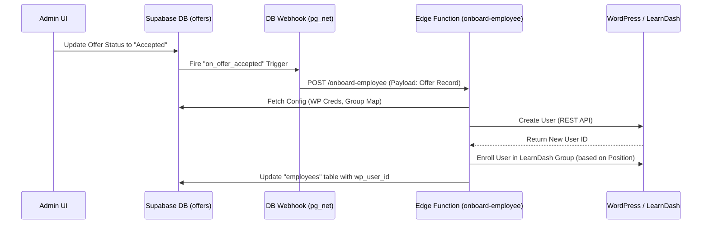

# Onboarding Automation: Technical Architecture & Flow

## 1. Overview
This document outlines the technical implementation of the automated employee onboarding flow for **Prolific Homecare**. The system automates the transition of a candidate from "Offer Accepted" to "Enrolled in LMS" using a serverless, event-driven architecture built on Supabase and WordPress/LearnDash.

## 2. Architecture

The solution leverages **Supabase Database Webhooks** and **Edge Functions** to create a robust, internal automation pipeline, replacing the need for external tools like Zapier or n8n.



## 3. Key Components

### 3.1. Database Layer (Supabase)
*   **`settings` Table:** Stores configuration secrets securely.
    *   `wp_api_url`: Endpoint for the WordPress REST API.
    *   `wp_username`: Admin username for API authentication.
    *   `wp_app_password`: Encrypted Application Password for secure access.
    *   `learndash_group_map`: JSON object mapping Job Positions to LearnDash Group IDs.
*   **`offers` Table:** The source of truth for offer status.
*   **`employees` Table:** Stores the link between the internal employee record and the external WordPress User ID (`wp_user_id`).
*   **Database Webhook:**
    *   **Trigger:** `on_offer_accepted`
    *   **Condition:** Fires `AFTER UPDATE` on `offers` when `old.status != 'Accepted'` AND `new.status = 'Accepted'`.
    *   **Mechanism:** Uses the `pg_net` extension to make an asynchronous HTTP POST request to the Edge Function.

### 3.2. Backend Layer (Supabase Edge Functions)
*   **Function:** `supabase/functions/onboard-employee/index.ts`
*   **Runtime:** Deno
*   **Logic:**
    1.  **Authentication:** Validates the request comes from a trusted internal source (Service Role).
    2.  **Configuration Fetch:** Retrieves encrypted WordPress credentials and the Group Map from the `settings` table.
    3.  **User Creation:**
        *   Checks if a WordPress user already exists with the applicant's email.
        *   If not, generates a random secure password and creates a new 'subscriber' user via `POST /wp/v2/users`.
    4.  **Role Mapping:**
        *   Parses the `learndash_group_map` JSON.
        *   Matches the applicant's `position_title` (e.g., "Licensed Practical Nurse") to the corresponding LearnDash Group ID(s).
    5.  **LMS Enrollment:**
        *   Calls the LearnDash API (`/ldlms/v2/groups/{id}/users`) to add the user to the correct training groups.
    6.  **Data Sync:** Updates the Supabase `employees` record with the returned `wp_user_id` for future reference.

### 3.3. External Integration (WordPress + LearnDash)
*   **API:** WordPress REST API + LearnDash REST API V2.
*   **Authentication:** Uses **Application Passwords** (Basic Auth) rather than user passwords, allowing for granular revocation and better security.

## 4. Security & Compliance

*   **Secret Management:** API keys and passwords are NOT hardcoded. They are stored in the `settings` table with `is_encrypted = true` (logical flag) and accessed only via the secure backend function.
*   **Network Security:** The Edge Function communicates directly with the WordPress server over HTTPS.
*   **Access Control:** The Database Webhook operates internally within the Supabase infrastructure. The Edge Function verifies the `Authorization` header to ensure it is only invoked by the system.
*   **Audit Trail:** All offer status changes are logged in the database.

## 5. Configuration Guide

The system is fully configuration-driven via the **Settings > Integrations** page in the Admin Dashboard:

1.  **WordPress API URL:** `https://training.yoursite.com/wp-json`
2.  **WordPress Admin Username:** The username of the admin account used for API calls.
3.  **Application Password:** The generated application password (created in WP Admin > Users > Profile).
4.  **LearnDash Group Map:** A JSON object defining the logic for course enrollment.
    *   *Example:*
        ```json
        {
          "Licensed Practical Nurse (LPN)": [101, 102],
          "Registered Nurse (RN)": [103],
          "Direct Care Worker": [104]
        }
        ```

## 6. Error Handling

*   **Duplicate Users:** If a user with the same email exists in WordPress, the system gracefully links the existing user instead of failing.
*   **API Failures:** Errors from WordPress (e.g., invalid credentials, down server) are logged in the Supabase Function Logs for debugging.
*   **Missing Configuration:** The function checks for missing settings before attempting execution and logs a warning if configuration is incomplete.
